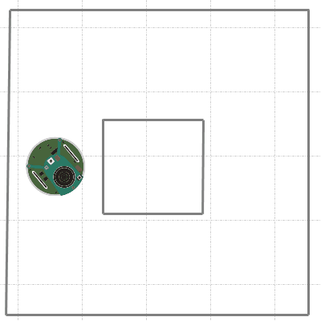
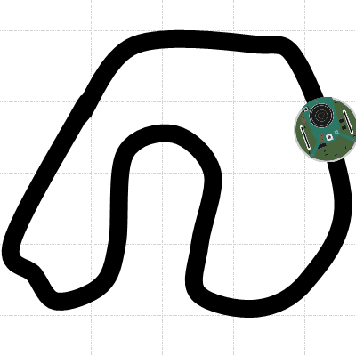

<<<<<<< HEAD
# pyePuck for robotBox
=======
# pyePuck
>>>>>>> 729c80e4ca50615969598cc92b837fc7055d199a

<<<<<<< HEAD
This is an adapted version of the [pyePuck](https://github.com/mmartinortiz/pyePuck) library to control the e-puck robot
on the [robotBox](https://github.com/ibonn/robotBox) simulator.
The usage is exactly the same, so you don't have to change your code when you use it with with a real e-puck

# Authors
* [mmartinortiz](https://github.com/mmartinortiz/) - _Original work_
* [ibonn](https://github.com/ibonn/) - _Modifications to make it work with robotBox_
=======
The aim of this library is to provide access to the ePuck robots
through a bluetooth connection. Thus, you can write a program that 
read from the ePuck's sensors and write in their actuators, This 
will allow us to create advanced programs that can develop a wide 
variety of complex tasks. It is necesary that the ePuck has installed 
the Webot's fimware 1.4.2 or 1.4.3. You can find this fantastic 
simulator on this site: http://www.cyberbotics.com/
>>>>>>> 729c80e4ca50615969598cc92b837fc7055d199a

# License

<<<<<<< HEAD
This project is licensed under [GNU GPL v3.0](LICENSE)
=======
- Python Bluetooth or Pybluez
- Python Image Library (PIL)

In this package you will find some examples of how to use this library.

You may expetience some problems when you work with your ePuck, We 
recommend you take into consideration the following special 
characteristic: we use a bluetooth communciation, therefore our bandwith 
is limited and we cannot expect to do too many tasks in short 
time; i.e:  If you put the wheels speed to max and want 
to make a quick process of the images, you will know what I'm saying. 
So remember, you are processing in your computer, not on the ePuck, 
and you need to take the sensors data and write on the actuators 
values on the ePuck

For further information and updates visit [the project wepage](https://blog.martinortiz.eu/projects/epuck-robot-libraries-for-teleoperation/)

**Note**: This library was design for Python 2. A lot of things have changed shince I started this development, and I do not have access to an ePuck anymore. 
>>>>>>> 729c80e4ca50615969598cc92b837fc7055d199a
